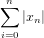
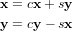
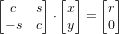
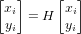
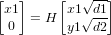
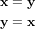

# nBLAS   

Node `>=4.0` C++ bindings for all single- and double-precision CBLAS (Basic Linear Algebra Subprograms) routines.

```bash
$ npm install nblas
$ npm test
```

**[BLAS Level 1 Routines and Functions](https://software.intel.com/en-us/node/468390)**
- [x] [`?asum (x)`](https://software.intel.com/node/e49cf403-8071-4252-a85f-28964ac3da9e#E49CF403-8071-4252-A85F-28964AC3DA9E)

  

- [x] [`?axpy (x, y, [alpha = 1])`](https://software.intel.com/node/e25d8e10-0440-4827-bc58-bc71128ea6ee#E25D8E10-0440-4827-BC58-BC71128EA6EE)

  

- [x] [`?copy (x, y)`](https://software.intel.com/node/20a9ac46-ce44-4a6a-8ce4-6a53d802a0b5#20A9AC46-CE44-4A6A-8CE4-6A53D802A0B5)

  

- [x] [`?dot (x, y)`](https://software.intel.com/node/d4e53c70-d8fa-4095-a800-4203cafe64fe#D4E53C70-D8FA-4095-A800-4203CAFE64FE)

  

- [x] [`?sdot`](https://software.intel.com/node/a0a4aefe-c291-4847-8242-5ecb3c08d6a5#A0A4AEFE-C291-4847-8242-5ECB3C08D6A5)
- [x] [`?nrm2 (x)`](https://software.intel.com/node/ea1df8e7-fc12-4a82-a804-b62956334c40#EA1DF8E7-FC12-4A82-A804-B62956334C40)

  
- [x] [`?rot (x, y, c, s)`](https://software.intel.com/node/742238c6-e459-4444-a694-7cc7500cf00f#742238C6-E459-4444-A694-7CC7500CF00F)

  
- [x] [`?rotg (x, y, c, s)`](https://software.intel.com/node/50049e08-b0f8-4270-80cc-7ab5d25eea3f#50049E08-B0F8-4270-80CC-7AB5D25EEA3F)

  
- [x] [`?rotm (x, y, param)`](https://software.intel.com/node/8ce9d22e-f4df-46a6-9a8a-faba22bdcc93#8CE9D22E-F4DF-46A6-9A8A-FABA22BDCC93)

  
- [x] [`?rotmg (d1, d2, x1, y1, param)`](https://software.intel.com/node/a28000eb-ea0b-488b-8058-4e1cb0e97074#A28000EB-EA0B-488B-8058-4E1CB0E97074)

  
- [x] [`?scal (x, alpha)`](https://software.intel.com/node/7269dcfe-7235-4690-a69e-d08712d8fc44#7269DCFE-7235-4690-A69E-D08712D8FC44)

  
- [x] [`?swap (x, y)`](https://software.intel.com/node/423ea638-1a23-46d8-a882-e022064edad7#423EA638-1A23-46D8-A882-E022064EDAD7)

  
- [x] [`i?amax (x)`](https://software.intel.com/node/c43c2490-109a-4a3b-8c5c-e8b67224bc03#C43C2490-109A-4A3B-8C5C-E8B67224BC03)

**[BLAS Level 2 Routines](https://software.intel.com/en-us/node/468426)**

**Enums**

- **trans**
  - **111** - `CblasNoTrans` **default**,
  - **112** - `CblasTrans`,
  - **113** - `CblasConjTrans`,
  - **114** - `AtlasConj`.

- **uplo**
  - **121** - `CblasUpper` **default**,
  - **122** - `CblasLower`.

- **diag**
  - **131** - `CblasNonUnit` **default**,
  - **132** - `CblasUnit`.

- **side**
  - **141** - `CblasLeft` **default**,
  - **142** - `CblasRight`.


- [x] [`?gbmv (a, x, y, [kl = 0], [ku = 0], [alpha = 1.0], [beta = 1.0], [trans = 111])`](https://software.intel.com/node/bc780af8-f243-4a20-b264-06424a8b5621#BC780AF8-F243-4A20-B264-06424A8B5621)

  

- [x] [`?gemv (a, x, y, [alpha = 1.0], [beta = 1.0], [trans = 111])`](https://software.intel.com/node/443228c4-626e-48a7-b230-26fb061eacf2#443228C4-626E-48A7-B230-26FB061EACF2)

  

- [x] [`?ger (a, x, y, [alpha = 1.0])`](https://software.intel.com/node/26a7befc-1a1d-4c19-b482-5e72e6b02417#26A7BEFC-1A1D-4C19-B482-5E72E6B02417)

  

- [x] [`?sbmv (a, x, y, [uplo = 121], [alpha = 1.0], [beta = 1.0])`](https://software.intel.com/node/c80f5eb2-d6c3-44e5-b0c8-9813a0c2340a#C80F5EB2-D6C3-44E5-B0C8-9813A0C2340A)

  

- [x] [`?spmv (ap, x, y, [uplo = 121], [alpha = 1.0], [beta = 1.0])`](https://software.intel.com/node/16cb58c4-105b-486c-b6aa-42bb0c721a76#16CB58C4-105B-486C-B6AA-42BB0C721A76)

  

- [x] [`?spr (ap, x, [uplo = 121], [alpha = 1.0])`](https://software.intel.com/node/f460bc61-5a47-4c0d-a2e0-a29adaa1b613#F460BC61-5A47-4C0D-A2E0-A29ADAA1B613)

  

- [x] [`?spr2 (ap, x, y, [uplo = 121], [alpha = 1.0])`](https://software.intel.com/node/c8dd665d-5e52-4214-aeab-ba4de61418e1#C8DD665D-5E52-4214-AEAB-BA4DE61418E1)

  

- [x] [`?symv (a, x, y, [uplo = 121], [alpha = 1.0], [beta = 1.0])`](https://software.intel.com/node/6265ba37-6e58-4c27-8035-92d836f58ec4#6265BA37-6E58-4C27-8035-92D836F58EC4)

  

- [x] [`?syr (a, x, [uplo = 121], [alpha = 1.0])`](https://software.intel.com/node/fcfba6db-8859-42e9-a626-3c74fc34b6c1#FCFBA6DB-8859-42E9-A626-3C74FC34B6C1)

  

- [x] [`?syr2 (a, x, [uplo = 121], [alpha = 1.0])`](https://software.intel.com/node/34efa07b-4a2a-42c3-90e2-d27b8a8f744e#34EFA07B-4A2A-42C3-90E2-D27B8A8F744E)

  

- [x] [`?tbmv (a, x, y, [uplo = 121], [trans = 111], [diag = 131])`](https://software.intel.com/node/14dfa68e-00c5-44c5-9e61-7279602af0c7#14DFA68E-00C5-44C5-9E61-7279602AF0C7)

  

- [x] [`?tbsv (a, x, [uplo = 121], [diag = 131])`](https://software.intel.com/node/0e673aed-9c3a-44af-92a5-4a5326d6a007#0E673AED-9C3A-44AF-92A5-4A5326D6A007)

  

- [x] [`?tpmv (ap, x, [uplo = 121], [trans = 111], [diag = 131])`](https://software.intel.com/node/f6666c0e-b843-4e12-9ad4-8898a6ef4018#F6666C0E-B843-4E12-9AD4-8898A6EF4018)

  

- [x] [`?tpsv (ap, x, [uplo = 121], [trans = 111], [diag = 131])`](https://software.intel.com/node/0eecd264-9871-4097-8af5-68eedae0d00a#0EECD264-9871-4097-8AF5-68EEDAE0D00A)

  

- [x] [`?trmv (a, x, [uplo = 121], [trans = 111], [diag = 131])`](https://software.intel.com/node/feb986db-24ff-4e64-9c44-289dde419eeb#FEB986DB-24FF-4E64-9C44-289DDE419EEB)

  

- [x] [`?trsv (a, x, [uplo = 121], [trans = 111], [diag = 131])`](https://software.intel.com/node/d8733073-f041-4aa1-b82c-123dfa993ad7#D8733073-F041-4AA1-B82C-123DFA993AD7)

  

**[BLAS Level 3 Routines](https://software.intel.com/en-us/node/468478)**
- [x] [`?gemm (a, b, c, m, n, k, [transa = 111], [transb = 111], [alpha = 1.0], [beta = 1.0])`](https://software.intel.com/node/90eaa001-d4c8-4211-9ea0-b62f5ade9cf0#90EAA001-D4C8-4211-9EA0-B62F5ADE9CF0)

  

- [x] [`?symm (a, b, c, m, n, [side = 141], [uplo = 121], [alpha = 1.0], [beta = 1.0])`](https://software.intel.com/node/cae55cbe-8e83-4c7f-9c54-0a8598f8a8ef#CAE55CBE-8E83-4C7F-9C54-0A8598F8A8EF)

  

- [x] [`?syrk (a, c, n, k, [uplo = 121], [trans = 111], [alpha = 1.0], [beta = 1.0])`](https://software.intel.com/node/e8986ce9-3048-4295-86ff-c2512669b498#E8986CE9-3048-4295-86FF-C2512669B498)

  

- [x] [`?syr2k (a, b, c, n, k, [uplo = 121], [trans = 111], [alpha = 1.0], [beta = 1.0])`](https://software.intel.com/node/1233ba19-4666-4233-ba59-106b9e644893#1233BA19-4666-4233-BA59-106B9E644893)

  

- [x] [`?trmm (a, b, m, n, [side = 141], [uplo = 121], [transa = 111], [diag = 131], [alpha = 1.0])`](https://software.intel.com/node/fe86b64a-4620-4e8f-8263-8442ace782df#FE86B64A-4620-4E8F-8263-8442ACE782DF)

  

- [x] [`?trsm (a, b, m, n, [side = 141], [uplo = 121], [transa = 111], [diag = 131], [alpha = 1.0])`](https://software.intel.com/node/ce40548f-549d-4af8-9668-b63b28c8c63f#CE40548F-549D-4AF8-9668-B63B28C8C63F)

  

Works out of the box with OSX since CBLAS is included in the standard Accelerate framework. You might have to download and build [LAPACK](http://www.netlib.org/lapack/#_lapack_version_3_6_0) from source on other operating systems (**LINUX:** `sudo apt-get libblas-dev`).

```javascript
var nblas = require('nblas');

var f64a = new Float64Array([1, 2, 3]),
    f64b = new Float64Array([4, 5, 6]);

nblas.dot(f64a, f64b); // or
nblas.ddot(3, f64a, 1, f64b, 1); // 32

var f32a = new Float32Array([1, 2, 3]),
    f32b = new Float32Array([4, 5, 6]);

nblas.dot(f32a, f32b); // or
nblas.sdot(3, f32a, 1, f32b, 1); // 32
```

Double precision functions expect `Float64Array` vectors, single precision functions expect `Float32Array` vectors.
